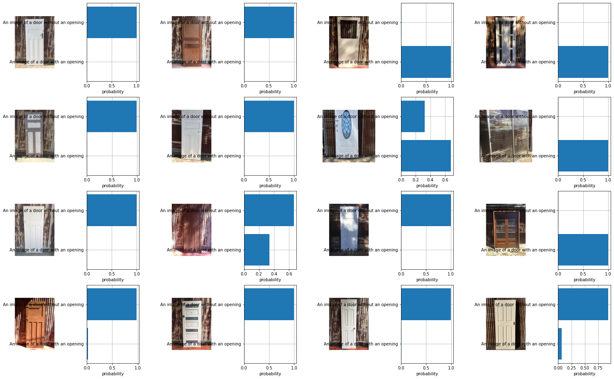

# SECOND LIFE

Second life // [Clip](https://openai.com/blog/clip/)

Sumer Matharu, Aleksandra Jastrzębska, Jonathan Hernández López and Jaime Cordero Cerrillo
IAAC, 2021.

## Abstract

This research focuses on one of the main problems in the AEC industry: the huge amount of waste it produces. As a contribution in our way to solve it, this tool classifies recycled elements which can have a second life, by learning visual concepts to finally match them with the search criteria that the user specifies.

## Datasets

The datasets that were used containing elements scraped from Google Images are the following:

 - `Doors`: Trained for condition, color, style, opening and structure.
 - `Flooring`: Trained for material, condition and color.
 - `Windows`: Trained for style, transparency and condition.
 - `Used lumber`: Trained for use.

## Model

This project uses two models:

 - `CLIP`: for classifying uploaded images considering the features and assign tags to them.
 - `MiniSOM`: for mapping the images from the dataset and offering the user a range of images based on the ones he previously selected.

## Getting started

### TRAIN

The tool uses the pre-trained model named CLIP, from AI, to classify the images. Each of the datasets were trained on the aformentioned features, so that it is able to assign a tag to each image for each of the trained features. Therefore, the input for these machine learning models is an image bank which can be found on the datasets.

If you want to work with this tool or develop it in some way you should clone this repository and start with these two options:
 - You can use the file `app.py` to load and classify your own images. This file is setting the backend of the tool for being able to load images and classify them with `Training\clip_classify_image.py`, where the actual classification is happening.
 - You can use your own datasets and train them to recognize more features in the existing elements or train new elements. For doing so, you should create a csv file containing the filenames of your image dataset and the assigned value for each of the new features, as in the existing csv files. After that you should use the file `Training\clip_train.py` to fine-tune the pre-trained CLIP model and improve the classification of those features.

### SOM

Once the dataset was classified and built, each image got a value assigned according to its features. Using this value, they could be mapped considering if they have openings or not, were new or old, etc. This map with the images is used to draw a path with MiniSOM connecting the selected points (images). Then, the images that get touched by that path are shown to the user as a recommendation.

To develop on this you should first create the new dataset with the assigned values for each image on the trained features, using `Training\clip_create_database.py`. Then, once you got the dataset you should use `SOM\second_life_SOM.ipynb` to map the images, draw the path with the selected ones and show the images that are on that path.